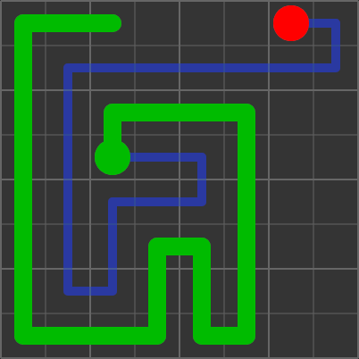

# Snake playing AI

A bunch of different algorithms that play the game of snake.

The snake moves around on a grid. Each time it eats an "apple" the snake grows longer. If the snake hits itself it dies, if the entire grid is filled the game is won.

## Usage

The program runs on the command line, and comes with help.

To build use `cmake`:

    mkdir build
    cmake -B build
    build/snake

## Algorithms

### Cell tree algorithm

The idea here is to limit the moves the snake can make. In each 2×2 cell it is always 'driving' on the right. So at any point there are only two possible moves. If the snake moves from one cell to another then the cells are connected.
If the connected cells form a tree, then the path of the snake must be a Hamiltonian cycle.
And if the connected cells form a tree, then the path of the snake must be a Hamiltonian cycle. You can also immagine the tree as a maze and the snake walking around it, keeping its right hand on the wall.

So, we enforce the following conditions
* Only make moves consistent with right-hand-driving in the 2×2 cell
* Only move to parents or unvisited nodes in the tree (this prevents cycles)
* Make sure that nodes don't become inaccessible (that would prevent a full spanning tree/Hamiltonian cycle from existing)

The first two conditions can be checked inside the shortest path algorithm, so we get a shortest path consistent with them. The third condition is trickier, and the algorithm uses some heuristics there. A key trick is to allow parts of the grid to become temporarily inaccessible, as long as they are accessible again when the snake reaches the goal (because the tail has moved).

### Simple fixed agents
Agents that follow a hardcoded Hamiltonian Cycle.

### Perturbed Hamiltonian Cycle

See https://johnflux.com/2015/05/02/nokia-6110-part-3-algorithms/

### Dynamic Hamiltonian Cycle Repair

A re-implementation of Brian Haidet's algorithm, see
https://github.com/BrianHaidet/AlphaPhoenix/tree/master/Snake_AI_(2020a)_DHCR_with_strategy

The basic idea is to maintain a Hamiltonian cycle over the grid, and then to try to take shortcuts along the shortest path to the goal if the Hamiltonian cycle can be repaired.

This version uses less hacks. For example instead of tweaking the A* algorithm, I updated the edge costs to take the existing cycle into account.

Currently does not include "nascar" or "applefear" modes.

## Results

Number of steps to finish the game on a 30×30 grid (over 100 runs)

|agent          |mean     |stddev   |min      |q.25     |median   |q.75     |max      |lost      |
|---------------|---------|---------|---------|---------|---------|---------|---------|----------|
|zig-zag        | 202529.7|   4652.9|   193677|   198820|   202236|   205846|   215937|      0.0%|
|fixed          | 202490.4|   4418.0|   190491|   199010|   202494|   205993|   212761|      0.0%|
|zig-zag-cut    | 105039.8|   3149.7|    98162|   102595|   104694|   107240|   113850|      0.0%|
|cell           |  49178.4|   2187.1|    44217|    47628|    48966|    50592|    56266|      0.0%|
|cell1          |  57393.5|   2528.5|    52207|    55668|    57332|    59260|    63365|      0.0%|
|cell-fixed     |  52035.8|   2400.6|    47367|    50604|    51721|    53440|    58447|      0.0%|
|cell-variant   |  47918.1|   2095.2|    43291|    46431|    47688|    49374|    53170|      0.0%|
|phc            | 103496.7|   2197.7|    98052|   101700|   103457|   105180|   109541|      0.0%|
|dhcr           |  60690.3|   2571.3|    55241|    59097|    60627|    62400|    67208|      3.0%|

Can be reproduced with `snake all`

## Visualization

There is javascript code to visualize a run in ./visualize. To use it:

    snake <agent> --json game.json
    $browser visualize/index.html?f=path/to/game.json

Here are some visualizations of runs of the different agents

* [zig-zag](https://twanvl.github.io/snake/?f=examples/zig-zag.json): Follows a fixed zig-zag cycle
* [zig-zag-cut](https://twanvl.github.io/snake/?f=examples/zig-zag-cut.json): Follows a zig-zag cycle, but can take shortcuts
* [fixed](https://twanvl.github.io/snake/?f=examples/fixed.json): Follows a fixed but random cycle
* [cell](https://twanvl.github.io/snake/?f=examples/cell.json): Cell tree algorithm
* [phc](https://twanvl.github.io/snake/?f=examples/phc.json): Perturbed Hamiltonian cycle
* [dhcr](https://twanvl.github.io/snake/?f=examples/dhcr.json): Dynamic Hamiltonian Cycle Repair

